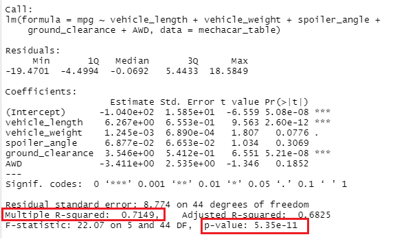
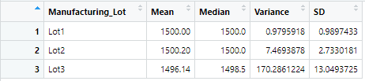
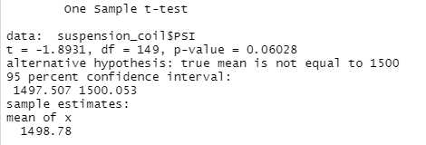
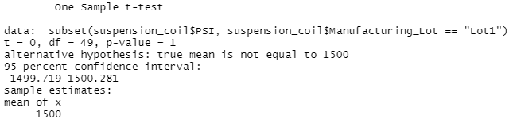
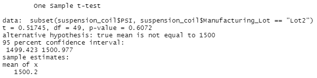
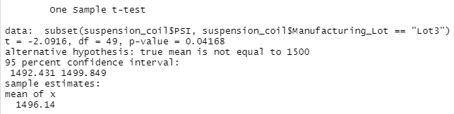

# MechaCar Statistical Analysis

## Overview of the analysis

This analysis dedicated to review the production data of AutosRUs’ newest prototype, the MechaCar. Using statistics and R the goal is to complete the following tasks:
- Perform multiple linear regression analysis to identify which variables in the dataset predict the mpg of MechaCar prototypes;
- Collect summary statistics on the pounds per square inch (PSI) of the suspension coils from the manufacturing lots;
- Run t-tests to determine if the manufacturing lots are statistically different from the mean population;
- Design a statistical study to compare vehicle performance of the MechaCar vehicles against vehicles from other manufacturers.

## Linear Regression to Predict MPG

- Which variables/coefficients provided a non-random amount of variance to the mpg values in the dataset?

    In the summary output, each Pr(>|t|) value represents the probability that each coefficient contributes a random amount of variance to the linear model. As from the above results we can see that vechicle length and ground clearance have a significant impact on mpg. P-values for both variables (2.60 x 10^(-12) and 5.21 x 10^(-08) respectively) are way below the assumed significance level (assuming a significance level of 0.05). 

- Is the slope of the linear model considered to be zero? Why or why not?

    At the bottom of our output we can see that the p-value of our linear regression analysis is 5.35 x 10^(-11), which is much smaller than our assumed significance level of 0.05. Therefore, we can state that there is sufficient evidence to reject our null hypothesis, which means that the slope of our linear model is not zero.

- Does this linear model predict mpg of MechaCar prototypes effectively? Why or why not?

    From our linear regression model, the r-squared value is 0.71, which means that roughly 71% of the variablilty of our dependent variable (mpg) is explained using this linear model.

## Summary Statistics on Suspension Coils

The design specifications for the MechaCar suspension coils dictate that the variance of the suspension coils must not exceed 100 pounds per square inch. Does the current manufacturing data meet this design specification for all manufacturing lots in total and each lot individually? Why or why not?

As from below summary for all lots we can see that the variance is 62.3, so it meets the specification:

But as per checking results for each lot we can see that only Lot3 doesn't meet the specification with variance of 170.3:

## T-Tests on Suspension Coils

The one-sample t-test is used to test the following hypotheses:

- H0 : There is no statistical difference between the observed sample mean and its presumed population mean.
- Ha : There is a statistical difference between the observed sample mean and its presumed population mean.

Using the `t.test()` function we were trying to determine if the PSI across all manufacturing lots is statistically different from the population mean of 1,500 pounds per square inch. Assuming our significance level is the common 0.05.

For all lots our p-value is slightly above our significance level = 0.06. This means that we do not have sufficient evidence to reject the null hypothesis, and we would state that the two means are statistically similar, although rather weak evidence:

For Lot1 we got p-value = 1, which is above 0.05, meaning we do not have sufficient evidence to reject the null hypothesis, and we would state that the two means are statistically similar.

For Lot2 we got p-value = 0.6, which is the same result as for Lot1 (two means are statistically similar):

For Lot3 we got p-value = 0.04, which is lower than our significance level, meaning we have sufficient evidence to reject the null hypothesis and state that the two means are statistically different.

## Study Design: MechaCar vs Competition

There are a lot of different metrics that we can consider to compare performance of the MechaCar vehicles vs competitors. Based on consumer interests it could be safety rating, fuel efficiency, cost, maintenance cost for family-oriented consumers or, for example, safety rating, number of cylinders, horsepower for sports car enthusiasts, etc.

To perform the analysis we need to build a null and alternative hypothesis, which are:
- The null hypothesis: there is no difference in MechaCar performance in comparison with the competitor's car for the same metrics.
- The alternative hypothesis: MechaCar's performance is much better than the competitor's car for the same metrics.

The best way to perform our analysis is to use the ANOVA test, which is used to compare the means of a continuous numerical variable across a number of groups (or factors in R). The main analytical question that this statistical test will answer us is - is there a statistical difference between the distribution means from ***multiple*** samples?

To perform an ANOVA test in R, we have to provide the `aov()` function two arguments:
1) formula - is a special statement in R that tells the `aov()` function how to interpret the different variables and factors;
2) data - is the name of our input data frame. The data frame should contain columns for each variable.

ANOVA tests have assumptions about the input data that must be validated prior to using the statistical test:
1) The dependent variable is numerical and continuous, and the independent variables are categorical.
2) The dependent variable is considered to be normally distributed.
3) The variance among each group should be very similar.